# PES-VCS — Version Control System from Scratch

A ground-up implementation of a Git-like version control system, built as part of the PES lab series. This project demonstrates how core VCS internals work — from content-addressable object storage to commit graphs and index staging.

---

## Screenshots

### Phase 1 — Object Storage

**1A: Object test output**
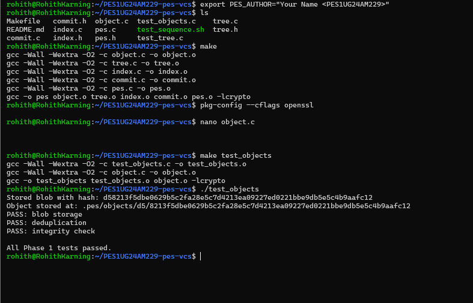

**1B: Object storage structure**
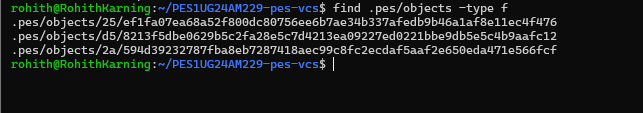

---

### Phase 2 — Tree Objects

**2A: Tree test output**
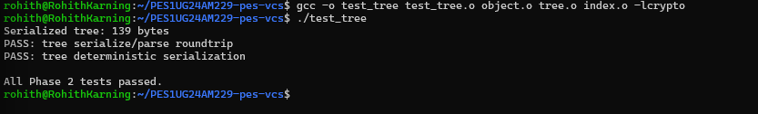

**2B: Raw tree object (xxd hex dump)**
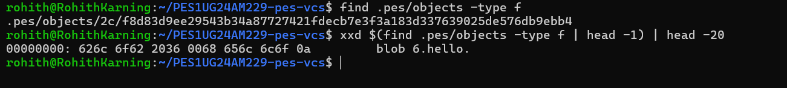

---

### Phase 3 — Index & Staging

**3A: init + add + status**
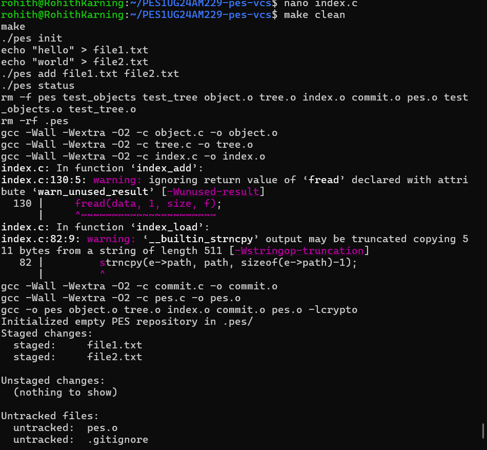
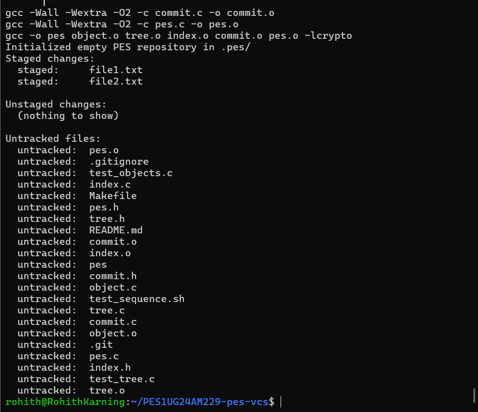

**3B: Index file contents**
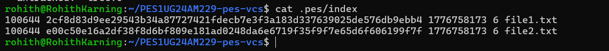

---

### Phase 4 — Commits & References

**4A: Commit log**
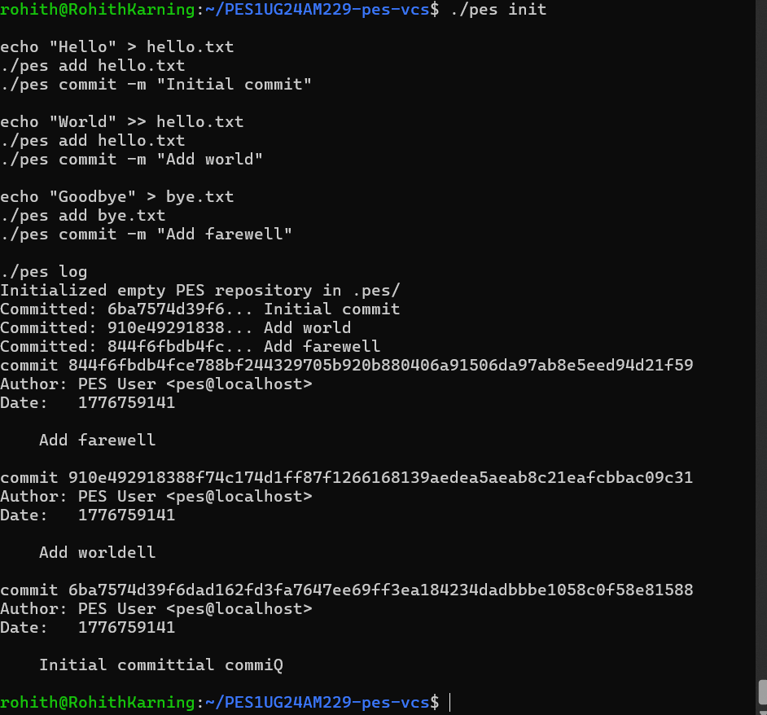

**4B: Object store growth**
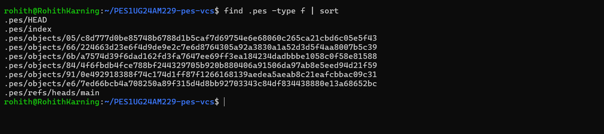

**4C: HEAD reference**
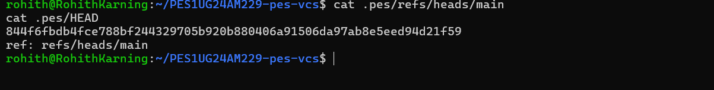

---

### Final Integration Test

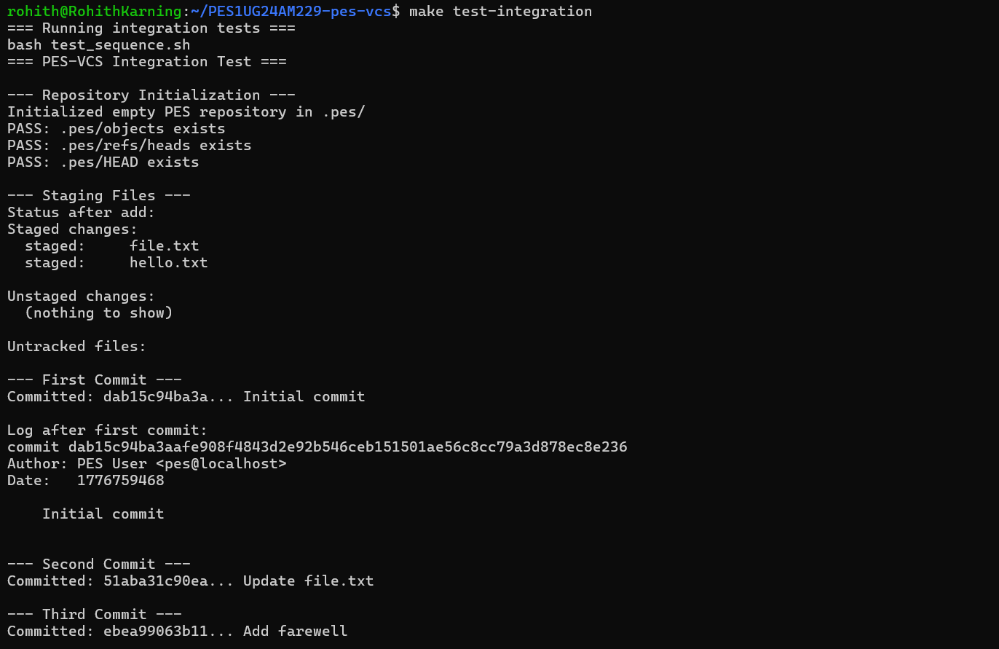
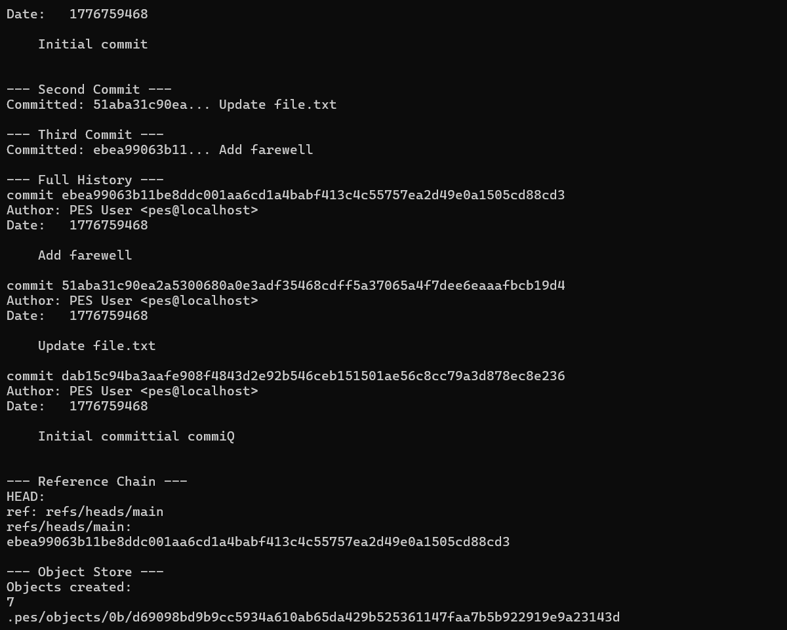
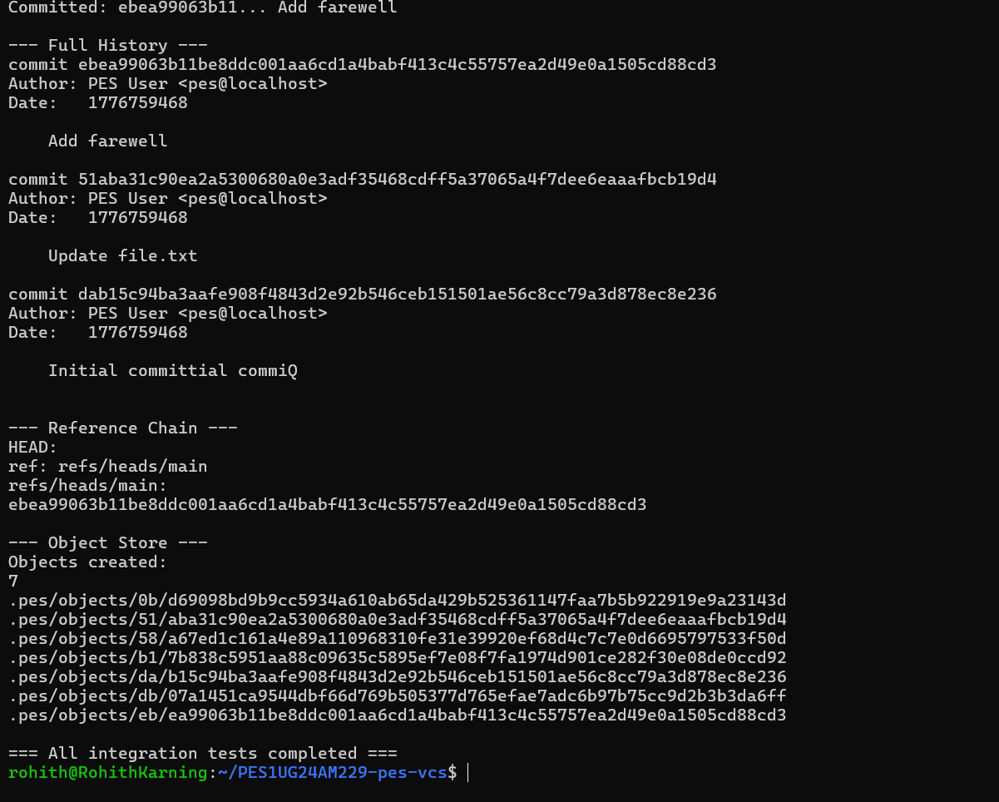

---

## Phase 5 — Analysis

### Q5.1 — Checkout Implementation

`pes checkout` must do two things: update the `.pes/` directory and restore the working tree to match the target branch's snapshot.

**`.pes/` directory changes:**
- `HEAD` is updated to `ref: refs/heads/<branchname>`
- If the branch is new, a file is created at `.pes/refs/heads/<branchname>` containing the current commit hash

**Working directory changes:**
- The target commit object is read to get its tree hash
- The tree is recursively walked; every blob is written to disk at its correct path
- Files present in the old branch but absent from the new one are deleted from disk

**Four complexities to handle simultaneously:**

| Problem | Description |
|---|---|
| Dirty working directory | Detect and refuse if local modifications would be silently overwritten |
| Recursive tree traversal | Nested subdirectories must be correctly created and populated |
| Deletions | Files in the old tree but absent from the new one must be removed from disk |
| Atomicity | A failed mid-checkout leaves the working directory broken; minimise that window |

---

### Q5.2 — Detecting a Dirty Working Directory

For each file tracked in the current index, two checks are performed:

**Step 1 — Metadata check (fast path)**
`stat` the file on disk and compare `mtime` and `size` against the stored index entry. If either differs, the file has been modified since it was last staged. This avoids re-hashing every file on every operation.

**Step 2 — Hash comparison**
Read the target branch's commit, resolve its tree, and find the blob hash for the same file path. Compare that hash against the current index entry.

**Decision logic:**

```
file modified on disk  AND  hash differs between branches  →  REFUSE checkout
                                "Your local changes would be overwritten"

file unmodified on disk  AND  hash differs between branches  →  safe to overwrite
```

This two-step check using `mtime`, `size`, and hash allows conflict detection without reading every file's full contents.

---

### Q5.3 — Detached HEAD State

**What it means:**
`.pes/HEAD` contains a raw commit hash instead of a branch reference (e.g. `ref: refs/heads/main`). This occurs when you checkout a specific commit rather than a branch name.

**What happens if you commit in this state:**
Commits are created correctly with parent pointers, but no branch ref is updated to track them. The moment you checkout a different branch, HEAD moves away and those commits become unreachable — nothing in `.pes/refs/` points to them.

**Recovery:**

*If you haven't switched away yet:*
```bash
# Write current HEAD hash to a new branch ref
echo <current-commit-hash> > .pes/refs/heads/recovery-branch
```

*If you've already switched away:*
You need the lost commit hash. In real Git this is recoverable via the reflog at `.git/logs/HEAD`, which records every position HEAD has ever held. Without a reflog, you must find the hash in terminal history. Once found, create a branch file pointing to it to make the chain reachable again.

---

## Phase 6 — Garbage Collection

### Q6.1 — Finding and Deleting Unreachable Objects

The algorithm follows a classic **mark-and-sweep** approach in two phases.

**Mark phase**
Starting from all branch refs in `.pes/refs/heads/` and `HEAD`, each commit hash is added to a reachable set. Each commit's tree hash is also added, and the tree is recursively walked — every sub-tree and blob is added to the set. The commit's parent pointer is followed and the process repeats until a root commit (no parent) is reached.

**Sweep phase**
Every file under `.pes/objects/` is visited. The hash is reconstructed from the path (first two characters form the shard directory; the rest is the filename). If the hash is absent from the reachable set, the file is deleted.

**Data structure:**
A hash table keyed on the 32-byte `ObjectID` is best, giving O(1) insertion and lookup. A sorted array with binary search is a simpler alternative at O(log n) per lookup.

**Scale estimate for 100,000 commits across 50 branches:**

Assuming ~25 objects per commit (1 commit object, 1 root tree, several sub-trees, ~15–20 blobs):

```
100,000 commits × 25 objects ≈ 2.5 million objects in the mark phase
Sweep phase reads the full .pes/objects/ directory listing (~same size)
Total: roughly 2–5 million file operations
```

---

### Q6.2 — GC Race Condition

**The problem:**
During commit creation, new objects are written to the object store *before* they are referenced by any branch or tag. This creates a window where they appear unreachable to an outside observer.

**The race:**

```
Thread A (commit)                  Thread B (GC)
─────────────────                  ─────────────
write blob objects          →      [blobs now on disk, unreferenced]
                                   mark phase: scans all refs
                                   does NOT see new blobs
                                   sweep phase: deletes blobs ← CORRUPTION
write tree + commit object  →      references now-deleted blobs
```

The repository is corrupt: the commit object points to blobs that no longer exist.

**How Git avoids it:**
- **Grace period**: Any loose object newer than a configurable threshold (default: 2 weeks) is never deleted by GC, regardless of whether it appears reachable. This gives any in-progress operation ample time to complete and establish references.
- **Lock file**: Git writes `.git/gc.pid` to prevent multiple GC processes from running simultaneously.
- **Age-gating**: GC only collects loose objects that have existed long enough that no concurrent operation could still be mid-way through referencing them.

---

## What This Project Implements

| Component | Description |
|---|---|
| Content-addressable storage | Objects stored and retrieved by SHA hash |
| Tree-based snapshots | Directory structure encoded as tree objects |
| Commit history | Linked list of commits via parent pointers |
| Index staging | Two-stage add-then-commit workflow |
| Reference tracking | `HEAD` and branch refs under `.pes/refs/heads/` |

This project demonstrates how Git works internally, using only filesystem primitives — no external VCS libraries.
